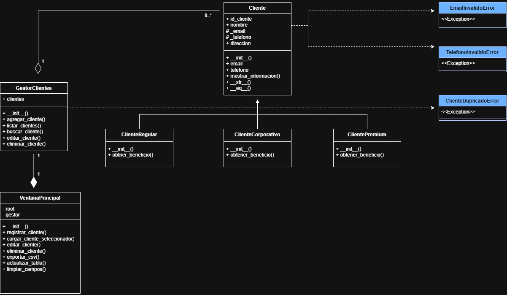

# Gestor Inteligente de Clientes

Proyecto desarrollado en Python para la gestión de clientes de la empresa ficticia SolutionTech.

El sistema permite registrar, visualizar, buscar, editar y eliminar clientes, diferenciándolos según su tipo: Regular, Premium o Corporativo.

Además, incorpora validaciones de datos, manejo de excepciones, persistencia en archivos JSON, exportación a CSV, interfaz gráfica con Tkinter, registro de errores y pruebas unitarias.

---

## Funcionalidades principales

- Registrar clientes.
- Listar clientes registrados.
- Buscar clientes por ID.
- Editar información de clientes.
- Eliminar clientes.
- Diferenciar clientes por tipo:
  - Cliente Regular.
  - Cliente Premium.
  - Cliente Corporativo.
- Asignar beneficios según el tipo de cliente.
- Validar email y teléfono.
- Detectar clientes duplicados.
- Guardar y cargar clientes desde JSON.
- Exportar clientes a CSV.
- Registrar errores mediante logs.
- Gestionar clientes mediante una interfaz gráfica desarrollada con Tkinter.

---

## Tipos de clientes

### Cliente Regular

Beneficio:

- 20% de descuento.

### Cliente Premium

Beneficios:

- Atención personalizada.
- 30% de descuento.

### Cliente Corporativo

Beneficios:

- Atención personalizada.
- 40% de descuento.

---

## Programación Orientada a Objetos

El proyecto aplica distintos conceptos de Programación Orientada a Objetos.

### Clase padre

La clase `Cliente` contiene los atributos y métodos comunes de todos los clientes.

Atributos principales:

- ID del cliente.
- Nombre.
- Email.
- Teléfono.
- Dirección.

### Herencia

Las siguientes clases heredan de `Cliente`:

- `ClienteRegular`
- `ClientePremium`
- `ClienteCorporativo`

### Polimorfismo

Cada tipo de cliente implementa el método:

```python
obtener_beneficio()
```

El comportamiento de este método cambia según el tipo de cliente.

### Encapsulación

Los atributos de email y teléfono utilizan propiedades para controlar el acceso y realizar validaciones antes de almacenar los datos.

Se utilizan los atributos protegidos:

```python
_email
_telefono
```

junto con `@property` y `@setter`.

### Métodos especiales

La clase `Cliente` incorpora los métodos especiales:

```python
__str__()
__eq__()
```

Estos permiten representar objetos como texto y comparar clientes según su ID.

---

## Validaciones

El sistema incorpora validaciones para evitar el ingreso de información incorrecta.

### Email

El email debe contener una estructura válida.

Ejemplo:

```text
cliente@gmail.com
```

### Teléfono

El teléfono:

- Debe contener solamente números.
- Debe tener 9 dígitos.

---

## Manejo de excepciones

El proyecto utiliza excepciones personalizadas:

- `EmailInvalidoError`
- `TelefonoInvalidoError`
- `ClienteDuplicadoError`

Estas permiten controlar errores específicos del sistema.

Los errores también son registrados utilizando el módulo estándar `logging`.

El archivo de registro se encuentra en:

```text
logs/errores.log
```

---

## Gestión de clientes

La clase `GestorClientes` administra la colección de clientes del sistema.

Incluye los siguientes métodos:

```python
agregar_cliente()
listar_clientes()
buscar_cliente()
editar_cliente()
eliminar_cliente()
```

El gestor también controla que no existan clientes con el mismo ID.

---

## Persistencia de datos

### JSON

Los clientes se guardan automáticamente en:

```text
datos/clientes.json
```

Al iniciar el programa, los clientes almacenados anteriormente son cargados nuevamente.

### CSV

El sistema permite exportar los clientes a:

```text
datos/clientes.csv
```

El archivo incluye:

- ID.
- Nombre.
- Email.
- Teléfono.
- Dirección.
- Tipo de cliente.
- Beneficio.

---

## Interfaz gráfica

La interfaz gráfica fue desarrollada utilizando Tkinter.

Permite:

- Registrar clientes.
- Visualizar clientes en una tabla.
- Seleccionar clientes.
- Editar clientes.
- Eliminar clientes.
- Exportar información a CSV.
- Limpiar los campos del formulario.

La clase principal de la interfaz es:

```text
VentanaPrincipal
```

---

## Estructura del proyecto

```text
gestor_clientes/
│
├── main.py
├── README.md
│
├── datos/
│   ├── clientes.json
│   └── clientes.csv
│
├── documentacion/
│   └── diagrama_uml.png
│
├── excepciones/
│   ├── __init__.py
│   └── excepciones.py
│
├── interfaz/
│   ├── __init__.py
│   └── ventana.py
│
├── logs/
│   └── errores.log
│
├── modelos/
│   ├── __init__.py
│   ├── cliente.py
│   ├── cliente_regular.py
│   ├── cliente_premium.py
│   └── cliente_corporativo.py
│
├── servicios/
│   ├── __init__.py
│   ├── gestor_clientes.py
│   ├── archivo_json.py
│   ├── archivo_csv.py
│   └── logger.py
│
└── tests/
    ├── __init__.py
    ├── test_cliente.py
    └── test_gestor_clientes.py
```

---

## Diagrama UML

El proyecto incluye un diagrama de clases UML que representa la estructura principal del sistema.

Se incluyen relaciones de:

- Herencia.
- Agregación.
- Composición.
- Dependencia con excepciones personalizadas.

Las principales relaciones son:

- `ClienteRegular` hereda de `Cliente`.
- `ClientePremium` hereda de `Cliente`.
- `ClienteCorporativo` hereda de `Cliente`.
- `GestorClientes` administra una colección de objetos `Cliente`.
- `VentanaPrincipal` contiene un objeto `GestorClientes`.
- `Cliente` utiliza las excepciones `EmailInvalidoError` y `TelefonoInvalidoError`.
- `GestorClientes` utiliza `ClienteDuplicadoError`.

A continuación se presenta el diagrama UML del sistema:



---

## Pruebas unitarias

El proyecto utiliza el módulo estándar `unittest`.

Para ejecutar todas las pruebas, utilizar:

```bash
python -m unittest discover tests
```

Actualmente se ejecutan 11 pruebas unitarias para validar:

- Creación de clientes.
- Validación de email.
- Validación de teléfono.
- Beneficio del cliente regular.
- Beneficio del cliente premium.
- Beneficio del cliente corporativo.
- Registro de clientes.
- Búsqueda de clientes.
- Edición de clientes.
- Eliminación de clientes.
- Detección de clientes duplicados.

El resultado esperado es:

```text
Ran 11 tests

OK
```

---

## Requisitos

- Python 3.
- Tkinter.

Los demás módulos utilizados forman parte de la biblioteca estándar de Python:

- `json`
- `csv`
- `logging`
- `unittest`
- `os`

---

## Ejecución del programa

Abrir una terminal dentro de la carpeta:

```text
gestor_clientes
```

Ejecutar:

```bash
python main.py
```

Se abrirá la interfaz gráfica del Gestor Inteligente de Clientes.

---

## Tecnologías utilizadas

- Python 3
- Programación Orientada a Objetos
- Tkinter
- JSON
- CSV
- Logging
- Unittest
- UML
- Visual Studio Code
- Git
- GitHub

---

## Autor

**Tamara González Orellana**

Proyecto desarrollado como evaluación del módulo 4.